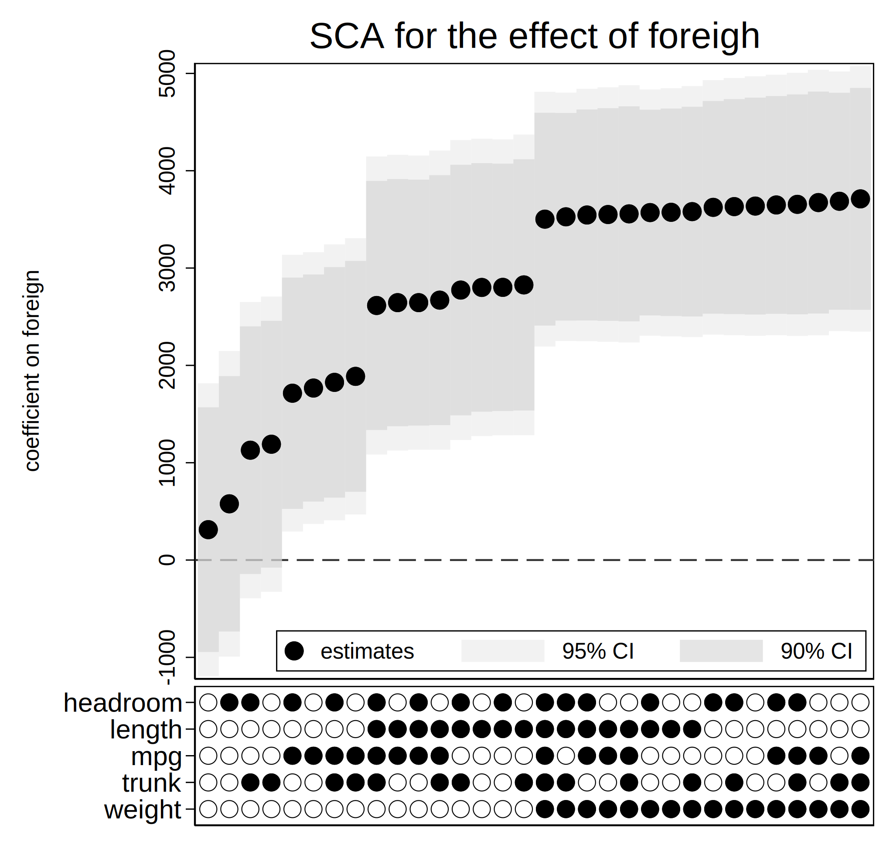
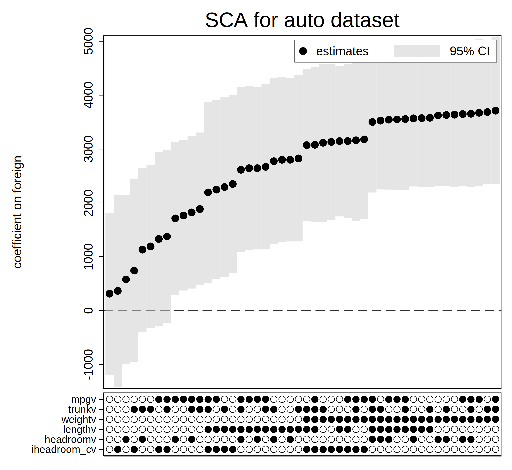

## Overview

Research reproducibility topic has been gaining momentum over the past decade. There have been many studies reporting inability to replicate published results and lack of necessary details in methods description. Some journals are addressing this issue by requiring access to study data and executable code. However, while this may provide some reassurance in reliability of the results, the actual choice of analytic methods could be shaped by many assumptions that might not be evident.

There usually isn't one correct way to analyse data. Instead, empirical studies often have plenty of flexibility in the way data are collected and cleaned as well as in the final model specification. A data cleaning step may involve exclusion of some units with missing data or conversion of a continuous variable to a categorical one or (vice versa). There also might be models equally plausible for the outcome, but having different sets of covariates or functional forms. Each of these small steps may snowball into a reported effect that is overly favorable to researchers' narrative.

A relatively novel and very promising method that can help to mitigate this issue was proposed in @simonsohn2015better and is called **Specification Curve Analysis** (SCA). The idea behind the method is simple - the researcher is asked to consider multiple plausible ways to analyze the data and show that, *jointly*, the null hypothesis of no effect can be rejected. It doesn't mean that all models must result in a statistically significant effect (though, it would make the conclusions very convincing!). However, even if the effect is detected when all specifications are tested simultaneously, this would result in a more objective inference.

## Method Details

The method involves the following steps:

(i) identifying the set of theoretically justified, statistically valid, and non-redundant analytic specifications;
(ii) running the analysis for each specification and displaying the results graphically - this allows the readers to identify consequential specification decisions;
(iii) conducting statistical tests to determine whether, as a whole, results are inconsistent with the null hypothesis.

The first two steps above are self-explanatory. However, the third step is novel. The authors (@simonsohn2020specification) proposed three test statistics for the SCA:

1.  median effect estimated across all specifications;

2.  share of specifications that obtain a statistically significant effect in the predicted direction;

3.  average of Z-values across all specifications.

For each of them a sampling distribution can be generating by "resampling under-the-null". This involves modifying the observed data so that the null hypothesis is known to be true, and then drawing random samples of the modified data. The test statistic of interest is then computed on each of those samples. The resulting distribution is the estimated distribution of the test statistic under the null.

## Available Tools

There are several resources available to aid the implementation of the method. I organize them in a table below:

+----------+-------------------------------------------------------------------------+---------------------------------------------------------------------------------------------------------------------------------------------------------------------------------------------------------------------------------------------------------------------------------------------------------------------------------------------------------------------------------------------------+
| Language | Package Name                                                            | Description                                                                                                                                                                                                                                                                                                                                                                                       |
+==========+=========================================================================+===================================================================================================================================================================================================================================================================================================================================================================================================+
| R        | [specr](https://masurp.github.io/specr/)                                | Available on CRAN. Provides functions to set up, run, evaluate and plot the specifications of interest. There is a lot of flexibility in model set-up. However, the package doesn't have capability to perform the step (iii) above (i.e., the joint testing).                                                                                                                                    |
+----------+-------------------------------------------------------------------------+---------------------------------------------------------------------------------------------------------------------------------------------------------------------------------------------------------------------------------------------------------------------------------------------------------------------------------------------------------------------------------------------------+
| R        | [rdfanalysis](https://joachim-gassen.github.io/rdfanalysis/)            | Available only on GitHub. A more comprehensive collection of functions that provides a self-documenting code base that allows researchers to systematically document and explore their researcher degrees of freedom when conducting analyses. Has a shiny front end that helps to explore the findings interactively.                                                                            |
+----------+-------------------------------------------------------------------------+---------------------------------------------------------------------------------------------------------------------------------------------------------------------------------------------------------------------------------------------------------------------------------------------------------------------------------------------------------------------------------------------------+
| Stata    | [speccurve](https://github.com/martin-andresen/speccurve)               | One function that can only plot the curve using coefficients stored in the **e()**-returns. Requires setting up and looping through the models beforehand.                                                                                                                                                                                                                                        |
+----------+-------------------------------------------------------------------------+---------------------------------------------------------------------------------------------------------------------------------------------------------------------------------------------------------------------------------------------------------------------------------------------------------------------------------------------------------------------------------------------------+
| Stata    | [specurve](https://github.com/mgao6767/specurve)                        | Depends on Stata 16's Python (v.3.6) integration and several additional Python modules. The function performs regressions as specified in a provided YAML-formatted file and plots the specification curve. Limited to `reghdfe` models only, but allows for various combinations of fixed effects and clustering.                                                                                |
+----------+-------------------------------------------------------------------------+---------------------------------------------------------------------------------------------------------------------------------------------------------------------------------------------------------------------------------------------------------------------------------------------------------------------------------------------------------------------------------------------------+
| Stata    | [specc](https://github.com/bbdaniels/specc)                             | Available on [SSC](https://econpapers.repec.org/software/bocbocode/s458720.htm) and is open for development on GitHub. The package appears to be very flexible in setting up models and enumerating specifications as well as plotting the curve. However, it lacks a simple example to get started.                                                                                              |
+----------+-------------------------------------------------------------------------+---------------------------------------------------------------------------------------------------------------------------------------------------------------------------------------------------------------------------------------------------------------------------------------------------------------------------------------------------------------------------------------------------+
| Python   | [specification_curve](https://github.com/aeturrell/specification_curve) | Allows to conduct analysis and plot specification curves. Flexible in model specification and very well [documented](https://specification-curve.readthedocs.io/en/latest/). While it also can't perform the joint test (step (iii) of the specification analysis), the author has an example of its manual implementation [here](http://aeturrell.com/2019/01/25/Specification-Curve-Analysis/). |
+----------+-------------------------------------------------------------------------+---------------------------------------------------------------------------------------------------------------------------------------------------------------------------------------------------------------------------------------------------------------------------------------------------------------------------------------------------------------------------------------------------+

It looks like most major statistical programming language have some version of the specification curve implemented. However, as far as I can tell, none of them are capable of performing step (iii), which, arguably, is as important as the curve itself. Therefore, for now, researches have to implement it themselves or contact RCS (research\@hbs.edu) for assistance!

## Stata Example

```{r, echo=FALSE, message=FALSE}
library(Statamarkdown)
```

Next, I show an example in Stata that loops through several model specifications and then uses the [speccurve](https://github.com/martin-andresen/speccurve) function in Stata to plot the curve. Before running this code, make sure that the function is installed in Stata by running the following line:

`net install speccurve, from("https://raw.githubusercontent.com/martin-andresen/speccurve/master")`

The code uses a classic `auto` data set and specifies several regression models that predict car price using available characteristics. The effect of interest is the coefficient estimated for the indicator `foreign`.

```{stata}
clear all
sysuse auto, clear

loc no=0

* enumerationg many different specifications using a loop
foreach m in "" "mpg" {
	foreach tr in "" "trunk" {
		foreach wt in "" "weight" {
			foreach ln in "" "length" {
				foreach hr in "" "headroom" {
					qui reg price foreign `m' `tr' `wt' `ln' `hr'
				  eststo md`no'
					loc ++no
				}
			}
		}
	}
}

* plotting a SC with foreign as a parameter of interest
speccurve *, param(foreign) controls title(SCA for the effect of foreigh)
graph export "speccurve1.svg", replace
```

The code above produced the following specification curve:



Looks like including the `weight` variable in the model had a notable effect on the coefficient for `foreign`. Function `speccurve` is somewhat limited in that it doesn't work with models that have factors as controls. Next, I show a workaround for the latter case:

```{stata, collectcode=TRUE}
clear all
sysuse auto, clear

egen headroom_c = group(headroom)
loc no=0

foreach m in "" "mpg" {
	foreach tr in "" "trunk" {
		foreach wt in "" "weight" {
			foreach ln in "" "length" {
				foreach hr in "" "headroom" "i.headroom_c"{
					qui reg price foreign `m' `tr' `wt' `ln' `hr'
					
					qui estadd scalar mpgv = 0, replace
					qui estadd scalar trunkv = 0, replace
					qui estadd scalar weightv = 0, replace
					qui estadd scalar lengthv = 0, replace
					foreach vr in m tr wt ln {
						if "``vr''"!="" qui estadd scalar ``vr''v = 1, replace
					}
					
					qui estadd scalar headroomv = 0
					qui estadd scalar iheadroom_cv = 0
					local vname = subinstr("`hr'", ".", "", .)
					qui estadd scalar `vname'v = 1, replace	
					
					eststo md`no'
					loc ++no
				}
			}
		}
	}
}

* The code below produces an error:
*speccurve *, param(foreign) controls title(SCA for the effect of foreigh)

* Workaround:
speccurve *, param(foreign) level(95) graphopts(legend(pos(1))) title(SCA for auto dataset) panel(mpgv trunkv weightv lengthv headroomv iheadroom_cv)
graph export "speccurve2.svg", replace
```

The code implements models that have `headroom` included as a factor or as a continuous variable. Note that the first call for `speccurve` would produce an error due to a bug in the function. However, the second call produces the following specification curve:



One can also output a table with numerical results:

```{stata}
matlist r(table)
```

## References
